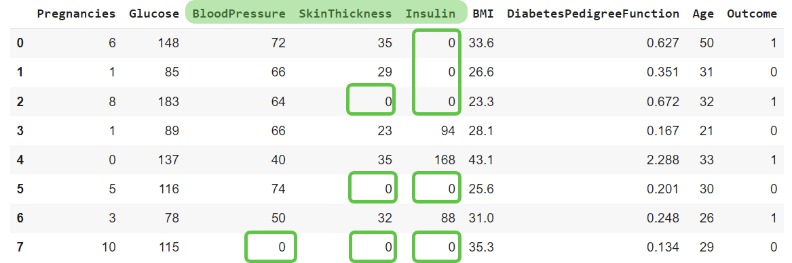
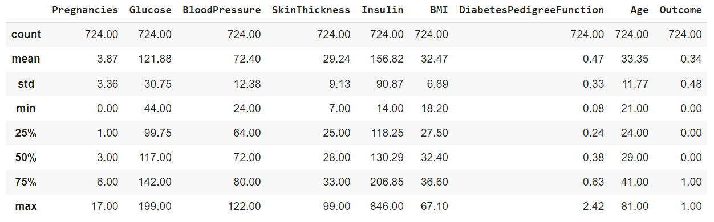
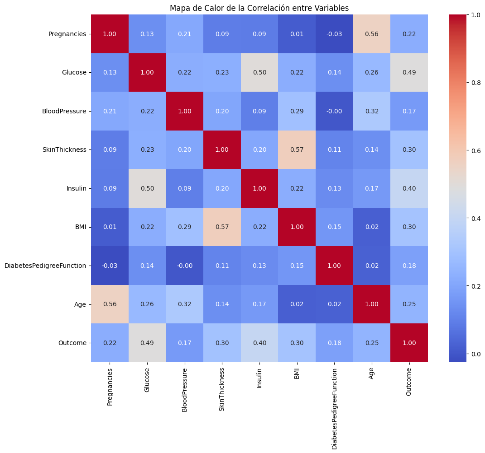
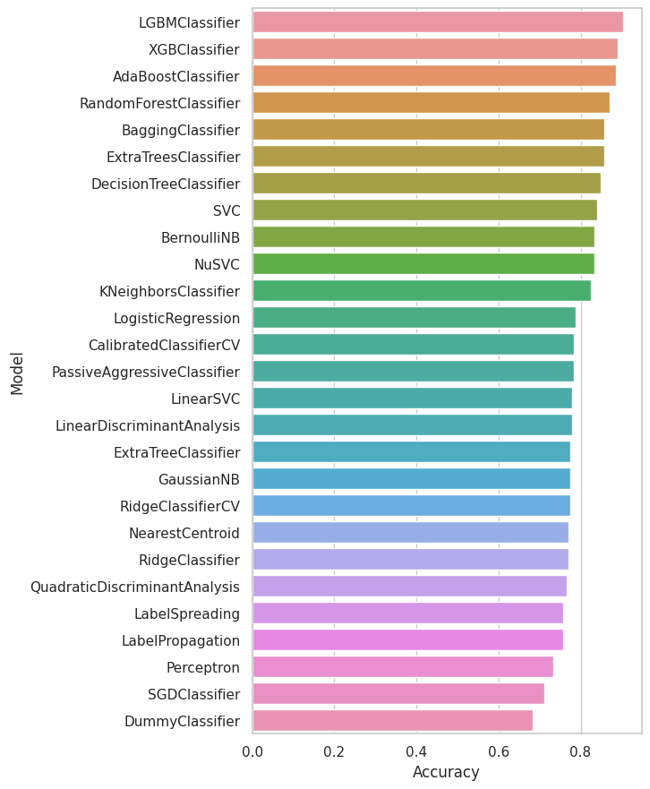
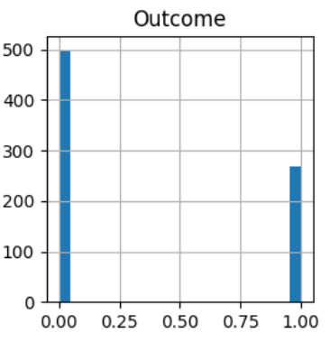

# Bedu
## Módulo 5 - Proyecto de Machine Learning
### ⚕️ Proyecto: Detección de Diabetes
**Equipo 14**   
- *Bruno Ivan Salgado Molina* 
- *José David Martínez Cantera* 
- *María del Pilar Piñones Contreras*   

---

### 📄 Introducción
Este proyecto busca prever si un paciente tiene diabetes o no, utilizando un conjunto de datos disponible en la plataforma [Kaggle](https://www.kaggle.com/uciml/pima-indians-diabetes-database).

#### Información del Dataset
**Población:** Los datos incluyen información de mujeres Pima, mayores de 21 años.

El Dataset se conforma de las siguientes **variables de diagnóstico:**

* **Pregnancies**: Número de embarazos
* **Glucose**: Glucosa en sangre
* **BloodPressure**: Presión arterial
* **SkinThickness**: Grosor de la piel
* **Insulin**: Insulina
* **BMI**: Índice de Masa Corporal
* **DiabetesPedigreeFunction**: Función que establece un valor de riesgo de diabetes por historia clínica familiar.
* **Age**: Edad

**La variable target es Outcome** con el valor 1 para positivo a Diabetes y 0 para negativo.
#### :dart: Objetivos y Tareas

- Crear Series y DataFrames y aprovecharlas a la perfección.
- Usar conceptos estadísticos para realizar un análisis exploratorio datasets para entender sus datos antes de realizar cualquier manipulación.
---

### ⬆️ Carga y preprocesamiento de datos
Se realizó la carga del archivo csv directamente a un [Notebook](https://colab.research.google.com/drive/1LPCDLF8ArAEODidUyWUracOF789XPkOf?usp=sharing) en Google Colab, así como los paquetes necesarios. 

Observamos los primeros registros del conjunto de datos.

<center></center>

**Primera observación:**

Podemos ver que la columna de SkinThickness presenta algunos valores nulos, lo que indica la falta de información. Del mimso modo que observamos ceros en la columna de Insulin, lo que tampoco puede considerarse un dato válido.

En general en un conjunto de datos sobre diabetes, columnas como **'Glucose', "BloodPressure', 'SkinThickness', "Insulin' y 'BMI' no deberían tener ceros como valores válidos.**

También se buscaron valores nulos, así como la homogeneidad de los datos.

```
La columna: 'Pregnancies' no tiene valores nulos
La columna: 'Glucose' no tiene valores nulos
La columna: 'BloodPressure' no tiene valores nulos
La columna: 'SkinThickness' no tiene valores nulos
La columna: 'Insulin' no tiene valores nulos
La columna: 'BMI' no tiene valores nulos
La columna: 'DiabetesPedigreeFunction' no tiene valores nulos
La columna: 'Age' no tiene valores nulos
La columna: 'Outcome' no tiene valores nulos
--------------------------------------------
El conjunto de datos no tiene valores nulos.
--------------------------------------------

La columna: 'Pregnancies' tiene formato homogéneo
La columna: 'Glucose' tiene formato homogéneo
La columna: 'BloodPressure' tiene formato homogéneo
La columna: 'SkinThickness' tiene formato homogéneo
La columna: 'Insulin' tiene formato homogéneo
La columna: 'BMI' tiene formato homogéneo
La columna: 'DiabetesPedigreeFunction' tiene formato homogéneo
La columna: 'Age' tiene formato homogéneo
La columna: 'Outcome' tiene formato homogéneo
--------------------------------------------
El conjunto de datos tiene formato homogéneo.
--------------------------------------------
```
---

### 1️⃣ Análisis Exploratorio de Datos

Se realizó el análisis mediante medidas de tendencia central para algunos de los campos, así como un análisis visual. Derivado de los ceros que se identificaron previamente, procedimos a determinar el porcentaje de los mismos para saber qué tanto alteraría los resultados.
```
La columna Glucose tiene 0.65 % de ceros.
La columna BloodPressure tiene 4.56 % de ceros.
La columna SkinThickness tiene 29.56 % de ceros.
La columna Insulin tiene 48.70 % de ceros.
La columna BMI tiene 1.43 % de ceros.
```
Procedimos a dar dos tipos de tratamiento:
- Para las variables con más de un 10% de ceros sustituímos los ceros por el valor promedio en los pacientes negativos a diabetes y positivos a diabetes, respectivamente.
- Para las variables con menos de un 10% de ceros, eliminamos las filas.

```
La columna Glucose tiene 0.00 % de ceros.
La columna BloodPressure tiene 0.00 % de ceros.
La columna SkinThickness tiene 0.00 % de ceros.
La columna Insulin tiene 0.00 % de ceros.
La columna BMI tiene 0.00 % de ceros.
```
Los descriptivos estadísticos generales son:

<center></center>

Para el análisis visual recurrimos a las siguientes gráficas:
<center></center>
<center></center>
<center></center>

**Información que se puede observar en las boxplot y** con los promedios para los diagnósticos positivos y negativos:

Los valores más altos de embarazos, glucosa, presión de sangre, ancho de la piel, insulina, función de diabetes y la edad parecen estar relacionados a un diagnóstico positivo de diabetes.

<center></center>

---

### 2️⃣ Modelo

**Problema:** El problema planteado es predecir si un paciente tiene diabetes basándose en ciertas medidas clínicas incluidas en el conjunto de datos. Este es un problema de clasificación binaria, ya que el resultado que queremos predecir es si el paciente tiene diabetes (1) o no (0).

Una herramienta muy útil para dar un primer vistazo a los modelos que son más prometedores para solventar un problema de clasificación es la herramienta LazyClassifier de la paquetería LazyPredict, la cual nos permite observar el desempeño aproximado que pueden tener diferentes modelos de clasificación.

<center></center>

Esto nos muestra que el modelo más prometedor es el Light Gradient Boost Machine Classifier que usa algoritmos de árboles de decisión.
Sin embargo, se decidió explorar algunos de los modelos que hemos trabajado en el curso ya que son con los cuales estamos más familiarizados.

Obtuvimos los siguientes resultados:
```
ROC AUC Score en Regresión logística: 0.8574574987955125
ROC AUC Score en Árboles de decisión: 0.8364305871016589
Perceptrón Multicapa. Precisión: 85%
```
Se encontraron ciertas configuraciones del perceptrón multicapa que dan a lugar a buenos porcentajes de clasificación. Sin embargo, en lo general se encontró que oscilan entre el 78% y el 85% de precisión, lo cual no es muy alto comparado con otros modelos.

---

### 3️⃣ Conclusiones

Podemos obtener las siguientes conclusiones:

- **Importancia de la limpieza de datos:** La identificación y corrección de valores cero en variables como la 'Insulina' y 'Grosor de la Piel' destacan la importancia crítica de la limpieza de datos en el análisis.

- **Relevancia de la Glucosa:** El análisis reveló que la glucosa es el factor más influyente en la predicción de la diabetes, lo que concuerda con el conocimiento médico actual sobre la diabetes. 
También hay relevancia del índice de masa corporal con un coeficiente positivo, indicando que los niveles más altos de BMI están asociados con la diabetes.
La edad tiene un impacto positivo en la probabilidad de tener diabetes, lo cual tiene sentido ya que el riesgo de diabetes aumenta con la edad.
Un número mayor de embarazos está asociado con un aumento en la probabilidad de diabetes, lo cual podría estar relacionado con la diabetes gestacional y su impacto en la salud a largo plazo.

- **Manejo de datos desbalanceados:** La evaluación de modelos en un contexto de desbalance potencial de clases (más pacientes sin diabetes que con diabetes) resalta la necesidad de técnicas específicas para manejar este desafío.

<center></center>

- **Importancia de la interpretación clínica:** La necesidad de interpretar los resultados del modelo en el contexto clínico subraya que un buen modelo no solo es estadísticamente válido, sino también clínicamente relevante.

- **Necesidad de validación y pruebas adicionales:** Los resultados indican la necesidad de validación externa y pruebas adicionales, particularmente en nuevos conjuntos de datos, para confirmar la generalización y robustez de los modelos de predicción.
